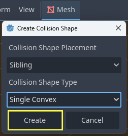
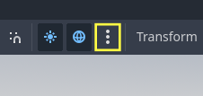
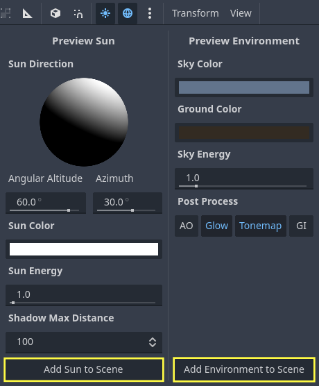

Tutorial - InteractiveGrid3D
============================

.. contents::
   :local:
   :depth: 2

.. only:: not i18n

  .. Note:: GitHub repository: https://github.com/antoinecharruel/interactive_grid_gdextension/tree/master/tutorial_demo_3d.

1 - Getting Started
-------------------

Launch Godot, create a new project, choose a location, and give it a name.

.. image:: ./img/create_new_project.png
   :alt: create_new_project.png
   :width: 400px

* In Godot, click AssetLib.
   * Search for ``Interactive Grid GDExtension``.
   * Download and install.

.. image:: ./img/ig_gde_asset_lib.png
   :alt: ig_gde_asset_lib.png
   :width: 300px

2 - Setting Up the Playable Area
--------------------------------

Create the Root Node
~~~~~~~~~~~~~~~~~~~~

* Click **+** and select ``3D Scene``.
* Rename the root Node `Node3D <https://docs.godotengine.org/en/stable/classes/class_node3d.html>`_ -> ``"World"``.

Add the Floor
~~~~~~~~~~~~~

* Select ``World``, click **+**, choose `MeshInstance3D <https://docs.godotengine.org/en/stable/classes/class_meshinstance3d.html>`_.
* Rename it ``"Floor"``.
* In the `Mesh <https://docs.godotengine.org/en/stable/classes/class_mesh.html>`_ property, select `PlaneMesh <https://docs.godotengine.org/en/stable/classes/class_planemesh.html>`_.
* Set ``Transform`` -> ``Scale`` to **20.0, 20.0, 20.0**.

Add Collision to the Floor
~~~~~~~~~~~~~~~~~~~~~~~~~~

* With ``Floor`` selected, click `Mesh <https://docs.godotengine.org/en/stable/classes/class_mesh.html>`_ -> ``Create Collision Shape``.

   * Collision Shape Placement: ``Static Body Child``.
   * Collision Shape Type: ``Single Convex``.

Set the Collision Layer for The Floor
~~~~~~~~~~~~~~~~~~~~~~~~~~~~~~~~~~~~~

* Select the `StaticBody3D <https://docs.godotengine.org/en/stable/classes/class_staticbody3d.html>`_ Node that was created for the ``Floor``.
* In the ``Collision`` Layer property, set it to 15.

.. only:: not i18n

  .. warning:: Assign it to ``Collision Layer 15``. This is important to ensure proper alignment of the grid on the ``floor``.

.. image:: ./img/floor_collision_layer.png
   :alt: floor_collision_layer.png
   :width: 250px

Add Light
~~~~~~~~~

`Preview environment <https://docs.godotengine.org/en/stable/tutorials/3d/environment_and_post_processing.html#preview-environment-and-sun-low-priority>`_: If no WorldEnvironment Node or DirectionalLight3D Node is present in the current scene, the editor will display a preview environment and sun instead. 
This can be disabled using the buttons at the top of the 3D editor:

Clicking on the 3 vertical dots on the right will display a dialog which allows you to customize the appearance of the preview environment:

* Add a Sun.
* Add an `Environment <https://docs.godotengine.org/en/stable/classes/class_environment.html>`_.

3 - Creating the Player Scene
-------------------------------

Create the Player Scene
~~~~~~~~~~~~~~~~~~~~~~~

* New scene, Select 3D Scene.
* Select `Node3D <https://docs.godotengine.org/en/stable/classes/class_node3d.html>`_.
* Rename it ``"PlayerPawn"``.

Add the Player Body
~~~~~~~~~~~~~~~~~~~

* Select ``"PawnPlayer"`` `Node3D <https://docs.godotengine.org/en/stable/classes/class_node3d.html>`_., click **+**, choose `CharacterBody3D <https://docs.godotengine.org/en/stable/classes/class_characterbody3d.html>`_.
* Rename it ``"Pawn"``.
* Add a visual `mesh <https://docs.godotengine.org/en/stable/classes/class_mesh.html>`_.
   
   * With ``Pawn`` selected, click **+**, choose `MeshInstance3D <https://docs.godotengine.org/en/stable/classes/class_meshinstance3d.html>`_.
   * In the Mesh property, select `CapsuleShape3D <https://docs.godotengine.org/en/stable/classes/class_capsuleshape3d3d.html>`_.
   * Hold the Control key and move the `CapsuleShape3D <https://docs.godotengine.org/en/stable/classes/class_capsuleshape3d3d.html>`_. up.
   * Rename it "Model".

Attach a CollisionShape3D to the Player
~~~~~~~~~~~~~~~~~~~~~~~~~~~~~~~~~~~~~~~

* Select the ``Pawn`` Node, click **+**, and add a `ColissionShape3D <https://docs.godotengine.org/en/stable/classes/class_colissionshape3d.html>`_.
* In the Mesh property, select `CapsuleShape3D <https://docs.godotengine.org/en/stable/classes/class_capsuleshape3d3d.html>`_.
* Hold the Control key and move the `CapsuleShape3D <https://docs.godotengine.org/en/stable/classes/class_capsuleshape3d3d.html>`_ up.

Attach a Camera3D to the Player
~~~~~~~~~~~~~~~~~~~~~~~~~~~~~~~

* Select the ``Pawn`` Node, click **+**, and add a `Camera3D <https://docs.godotengine.org/en/stable/classes/class_camera3d.html>`_ Node.
* Set the ``Transform`` -> **Position** to **6.0**, **10.0**, **6.0**.
* Set **FOV** to **60.0°** .
* Set **Rotation** **X** to **-45.0°** and Rotation **Y** to **45.0°**.

4 - Moving the player with code
-------------------------------

* Select ``"Pawn"``, then attach *"pawn.gd"* script to the player.

This script allows moving the player from point A to point B in the world.

.. code-block:: gdscript
   :force:

   # pawn.gd

   extends CharacterBody3D

   @onready var model: MeshInstance3D = $Model
   @onready var interactive_grid_3d: InteractiveGrid3D = $"../InteractiveGrid3D"

   const SPEED:float = 5.0

   func _physics_process(delta: float) -> void:
      # Add the gravity.
      if not is_on_floor():
         velocity += get_gravity() * delta
         move_and_slide()

   func move_to(global_position: Vector3)-> void:
      var pawn_global_position:Vector3 = self.global_position
      var target_global_position: Vector3 = Vector3(global_position.x, pawn_global_position.y, global_position.z)
      var direction:Vector3 = (target_global_position - pawn_global_position).normalized()
      var distance_to_target: float = pawn_global_position.distance_to(target_global_position)

      self.velocity = direction * SPEED

      var dir: Vector3 = (target_global_position - model.global_position)
      dir.y = 0
      dir = dir.normalized()

      var target_rot: float = atan2(-dir.x, -dir.z)
      model.rotation.y = lerp_angle(model.rotation.y, target_rot, 0.2)

      move_and_slide()

5 - Raycast From Mouse
-------------------------------

Add a Raycast3D Node
~~~~~~~~~~~~~~~~~~~~

* Select ``PawnPlayer``. 
* Click **+** and add a `Raycast3D <https://docs.godotengine.org/en/stable/classes/class_raycast3d.html>`_ Node.
 
* Rename it *“RayCastFromMouse”*.

Attach the Script
~~~~~~~~~~~~~~~~~

* Select RayCastFromMouse. 
* Click on the Attach Script icon and fill it.

This script allows you to send a raycast from the mouse to get the world coordinates. 
It will be useful for selecting a cell on the grid.

.. code-block:: gdscript
   :force:

   # ray_cast_from_mouse.gd

   extends RayCast3D

   @onready var camera_3d: Camera3D = $"../Pawn/Camera3D"
   @export var debug_sphere_raycast: MeshInstance3D

   func _ready() -> void:
      debug_sphere_raycast = MeshInstance3D.new()
      debug_sphere_raycast.mesh = SphereMesh.new()
      var mat_target: StandardMaterial3D = StandardMaterial3D.new()
      mat_target.albedo_color = Color.GREEN
      debug_sphere_raycast.material_override = mat_target
      debug_sphere_raycast.scale = Vector3(0.3, 0.3, 0.3)
      add_child(debug_sphere_raycast)
      debug_sphere_raycast.visible = false

   func _process(delta: float) -> void:
      debug_sphere_raycast.global_transform.origin = get_ray_intersection_position()

   func get_ray_intersection_position() -> Vector3:
      var intersect_ray_position: Vector3 = Vector3.ZERO
      var mouse_pos:Vector2 = get_viewport().get_mouse_position()
      var ray_origin:Vector3 = camera_3d.project_ray_origin(mouse_pos)
      var ray_direction:Vector3 = camera_3d.project_ray_normal(mouse_pos)
      var ray_length:int = 2000

      self.global_position = ray_origin
      self.target_position = ray_direction * ray_length
      self.collide_with_areas = false
      self.collision_mask = 0
      self.set_collision_mask_value(15, true)
      self.set_collision_mask_value(1, false)
      self.force_raycast_update()

      if self.is_colliding():
         var collider:Node3D = self.get_collider()

         intersect_ray_position = self.get_collision_point()
         #print("[get_ray_intersection_position] Collision detected at: ", intersect_ray_position)
         #print("[get_ray_intersection_position] Collision detected with: ", collider.name)

      return intersect_ray_position

6 - Configuring the Interactive Grid
------------------------------------

Add InteractiveGrid3D
~~~~~~~~~~~~~~~~~~~~~

Select ``PlayerPawn``, click **+**, and add a ``InteractiveGrid3D`` Node.

Set Grid Size
~~~~~~~~~~~~~

* ``Rows``: **13**
* ``Columns``: **13**

Add a Cell Size
~~~~~~~~~~~~~~~

**Which dimensions should we choose?**

Assuming ``cell_size.x`` = **1.0**

"The size of a regular hexagon can be described by either the inner circle, touching the edges, or the outer circle, touching the corners."
`Hexagonal Grids Basics <https://www.redblobgames.com/grids/hexagons/#basics>`_

**Finding the inradius (r):**

The vertical distance is given by √3 * the inradius.

Since ``cell_size.x`` = 2 * the inradius:

* inradius = ``cell_size.x`` / 2
* ``cell_size.y`` = √3 * inradius.
* ``cell_size.y`` = **0.866**

Add a Cell Mesh
~~~~~~~~~~~~~~~

Select ``InteractiveGrid3D``, go to the Inspector -> ``Cell Mesh property``.
Click on the mesh field and select `CylinderMesh <https://docs.godotengine.org/en/stable/classes/class_cylindermesh.html>`_.

**Which dimensions should we choose?**

* ``Top_radius`` = Circumradius (R)
* ``Bottom_radius`` = Circumradius (R)

**Finding the Circumradius (R):**

We know that:

* inradius (r) = a · √3 / 2 = 0.5
* side length (a) = r * 2 / √3 = 0.577
* circumradius (R) = a = 0.577

Therefore:

* ``Top_radius`` = a = **0.577**
* ``Bottom_radius`` = a = **0.577**
* ``Height`` = **0.1**

To create a hexagonal shape:

   * ``Radial Segments:`` **6**

Add a Cell Shape
~~~~~~~~~~~~~~~~~

* Select ``Cell Shape property``.
* Click on the mesh field and select `CylinderShape3D <https://docs.godotengine.org/en/stable/classes/class_cylindershape3d.html>`_.

* ``Height`` = **6**
* ``Top_radius`` = inradius = ``cell_size.x`` / 2 = **0.5**
* ``Bottom_radius`` = **0.5**

Set ``cell_shape_offset.y`` to **Height / 2**, which equals **3.0**.

.. only:: not i18n

  .. tip:: Add a debug collision shape and include these lines in the script 
   *interactive_grid.gd* inside the *show_grid()* function, and enable ``Visible Collision Shape``
   in the ``Debug tab`` of the editor.

   .. code-block:: gdscript
      :force:

      var cell_global_xform: Transform3D = get_cell_global_transform(cell_index)
      var offset:Vector3 = get_cell_shape_offset()
      var offset_xform:Transform3D = Transform3D(Basis.IDENTITY, offset)
      debug_collision_shape_area_3d.global_transform = cell_global_xform * offset_xform

Multiply all values by two to double the size of the grid cells.

* ``cell_size``

   * ``cell_size_x`` = **2**
   * ``cell_size_y`` = **1.732**

* ``cell_mesh``

   * ``Height`` = **6**
   * ``Top_radius`` = **1.14**
   * ``Bottom_radius`` = **1.14**

* ``cell_shape``

   * ``Height`` = **6**
   * ``Top_radius`` = **1**

.. image:: ./img/interactive_grid.png
   :alt: interactive_grid.png
   :width: 600px

Set Layout
~~~~~~~~~~

  * Select ``Layout property``.
  * Click on the dropdown menu and select ``HEXAGONAL``.

Set Movement
~~~~~~~~~~~~

  * Select ``Movement property``.
  * Click on the dropdown menu and select ``SIX-DIRECTIONS``.

7 - Interactive Grid Scripting
------------------------------

Attach a Script 
~~~~~~~~~~~~~~~

* Select the ``InteractiveGrid3D`` Node. 
* Click Attach Script. 
* Fill in the script.

.. code-block:: gdscript
   :force:
   
   # interactive_grid_3d.gd

   extends InteractiveGrid3D

   @onready var ray_cast_from_mouse: RayCast3D = $"../RayCastFromMouse"

   var _path: PackedInt64Array = []
   var _pawn: CharacterBody3D = null

   @onready var debug_collision_shape_area_3d: CollisionShape3D = $"../DebugCollisionShapeArea3D/DebugCollisionShapeArea3D"

   func _ready() -> void:
      pass

   func _process(delta: float) -> void:
      if _pawn == null: 
         return

      if self.get_selected_cells().is_empty():
         self.highlight_on_hover(ray_cast_from_mouse.get_ray_intersection_position())
      else:
         move_along_path(_path)

   func show_grid():
      #region InteractiveGrid3D Center
      ## Here, the grid is centered around the player.
      ## !Note: This operation repositions all cells, aligns them with the environment,
      ## rescans obstacles and custom data, and refreshes A* navigation.
      ##  - Manual modifications can also be applied here, such as:
      ##     - Hiding cells beyond a certain distance
      ##     - compute_unreachable_cells
      ##     - Adding custom data
      #endregion
      
      if _pawn == null:
         return

      print("show_grid")

      _path = []
      self.set_visible(true)
      self.center(_pawn.global_position)

      var pawn_current_cell_index: int = self.get_cell_index_from_global_position(_pawn.global_position)

      # To prevent the player from getting stuck.
      self.set_cell_accessible(pawn_current_cell_index, true)
      self.set_cell_reachable(pawn_current_cell_index, true)

      self.hide_distant_cells(pawn_current_cell_index, 6)
      self.compute_unreachable_cells(pawn_current_cell_index)

      #region update_custom_data()
      ## !Note: Don't forget to call update_custom_data().
      ## It refreshes custom_cell_flags, colors, and the A* configuration
      ## based on the newly updated CellCustomData.
      #endregion
      self.update_custom_data()

   func _input(event):
      if event is InputEventMouseButton and event.button_index == MOUSE_BUTTON_LEFT:
         if _pawn == null:
            return

         var ray_pos: Vector3 = ray_cast_from_mouse.get_ray_intersection_position()
         if ray_pos == null:
            return

         var selected_cells: Array = self.get_selected_cells()
         if selected_cells.size() < 1:
            var hit_cell_index: int = self.get_cell_index_from_global_position(ray_pos)
            self.select_cell(hit_cell_index)
            selected_cells = self.get_selected_cells()
            if selected_cells.is_empty():
               return

            var pawn_current_cell_index: int = self.get_cell_index_from_global_position(self.get_center_global_position())
            self.set_cell_accessible(pawn_current_cell_index, true)
            _path = self.get_path(pawn_current_cell_index, selected_cells[0])
            print("Last selected cell:", self.get_latest_selected())
            print("Path:", _path)
            self.highlight_path(_path)

   func move_along_path(path: PackedInt64Array)-> void:
      if path.is_empty():
         show_grid()
         return

      var target_cell_index: int = path[0]
      var target_global_position: Vector3 = get_cell_global_position(target_cell_index)
      if not is_on_target_cell(_pawn.global_position, target_global_position, 0.20):
         reaching_cell_target(target_cell_index, path)
      else:
         target_cell_reached()

   func reaching_cell_target(target_cell_index: int, path: PackedInt64Array) -> void:
      if _path.size() > 0:
         var target_cell_global_position: Vector3 = self.get_cell_global_position(target_cell_index)
         if _pawn.has_method("move_to"):
            _pawn.move_to(target_cell_global_position)
         else:
            printerr("pawn does not have the 'move_to' method.")

   func target_cell_reached():
      if not _path.is_empty():
         _path.remove_at(0)

   static func is_on_target_cell(current_global_position: Vector3, target_global_position: Vector3, threshold: float) -> bool:
      return current_global_position.distance_to(target_global_position) <= threshold

   func set_pawn(pawn: CharacterBody3D):
      _pawn = pawn

Input
~~~~~

* Add an input action to allow opening the grid using the ``Space key``.

* Go to **Project -> Project Settings ->** ``Input Map`` tab.

* Click **Add New Action**.

* Enter **"show_grid"**.

* Click **Add**.

* Click the **`+`** button next to the action.

* Assign the ``Space key`` as the input.

Add the following code block at the end of the *pawn.gd* script:

.. code-block:: gdscript
   :force:
   
   func _input(event):
      if event.is_action_pressed("show_grid"):
         interactive_grid_3d.set_pawn(self)
         interactive_grid_3d.show_grid()

8 - Preparing the World Scene
-----------------------------

Add the Player Pawn scene to the World scene.

* **Create a wall.**

  * **Add a parent Node for the walls.**

    * Click **+**, select `Node3D <https://docs.godotengine.org/en/stable/classes/class_node3d.html>`_.
    * Rename it ``"Walls"``.

  * **Add the wall mesh.**

    * Select Walls, click **+**, choose `MeshInstance3D <https://docs.godotengine.org/en/stable/classes/class_meshinstance3d.html>`_.
    * Set Transform -> Scale to **3.0, 3.0, 0.5.**

  * **Add collision.**

   * Set the ``Collision Shape`` Type to ``Single Convex``.
   * Assign the `StaticBody3D <https://docs.godotengine.org/en/stable/classes/class_staticbody3d.html>`_ to ``Collision Layer 14``.

.. only:: not i18n

  .. warning:: Assign it to ``Collision Layer 14``. This is important to ensure that the grid correctly detects obstacles.

9 - Add Custom Shader
----------------------

It is possible to add a custom shader to the grid.

Each grid cell has states stored in a bitmask. The flags can be retrieved via the alpha channel of ``INSTANCE_CUSTOM``.

**Example of retrieving default flags:**

.. code-block:: glsl
   :force:

   // Default cell flags:
   const int CFL_ACCESSIBLE = 1 << 0;
   const int CFL_REACHABLE = 1 << 1;
   const int CFL_IN_VOID = 1 << 2;
   const int CFL_HOVERED = 1 << 3;
   const int CFL_SELECTED  = 1 << 4;
   const int CFL_PATH = 1 << 5;
   const int CFL_VISIBLE = 1 << 6;

   void vertex() {
    instance_c = INSTANCE_CUSTOM;
    int cell_flag = int(instance_c.a);

* Click on ``InteractiveGrid3D`` -> ``MaterialOverride`` -> `ShaderMaterial <https://docs.godotengine.org/en/stable/classes/class_shadermaterial.html>`_.
* In the ``Shader`` field, click New Shader.
* Name it *interactive_grid.gdshader*.

**Example shader script:**

.. code-block:: glsl
   :force:
   
   // interractive_grid.gdshader

   shader_type spatial;
   render_mode unshaded, cull_disabled, depth_draw_opaque;

   varying vec4 instance_c;
   varying vec4 instance_c_default;
   varying float alpha;

   // Default cell flags:
   const int CFL_ACCESSIBLE = 1 << 0;
   const int CFL_REACHABLE = 1 << 1;
   const int CFL_IN_VOID = 1 << 2;
   const int CFL_HOVERED = 1 << 3;
   const int CFL_SELECTED  = 1 << 4;
   const int CFL_PATH = 1 << 5;
   const int CFL_VISIBLE = 1 << 6;

   void vertex() {
      instance_c = INSTANCE_CUSTOM;
      int cell_flag = int(instance_c.a);
      alpha = 0.5;
      
      if ((cell_flag & CFL_ACCESSIBLE) == 0) {
         alpha = 0.20;
      }

      if ((cell_flag & CFL_PATH) != 0) {
         VERTEX.y += sin(TIME * 4.0 + VERTEX.x * 2.0) * 0.2;
      }
      
      if ((cell_flag & CFL_HOVERED) != 0) {
         VERTEX.y += sin(TIME * 4.0) * 0.2;
      }
      
      if ((cell_flag & CFL_VISIBLE) == 0) {
         alpha = 0.0; // invisible
      }
      
      if ((cell_flag & CFL_REACHABLE) == 0) {
         alpha = 0.0; // invisible
      }
      
      if ((cell_flag & CFL_IN_VOID) != 0) {
         alpha = 0.0; // invisible
      }
   }

   void fragment() {
      if (alpha == 0.0) {
         discard;
      }
      ALBEDO = instance_c.rgb;
      EMISSION = instance_c.rgb;
      ALPHA = alpha;
   }

10 - Add Custom Cell Data
-------------------------

It is also possible to add additional states to specific cells, on top of the default cell states.

There are two ways to achieve this:

* Add a ``CustomCellData`` using a collision mask.
* Add a ``CustomCellData`` via code to a specific cell.

Example: Adding a Trap That Interacts with the Grid
~~~~~~~~~~~~~~~~~~~~~~~~~~~~~~~~~~~~~~~~~~~~~~~~~~~

Let's imagine you want to add a trap to your world and make it interact with the grid.

* Trap setup in the World scene.

   * Select the World scene.
   * Add a `MeshInstance3D <https://docs.godotengine.org/en/stable/classes/class_meshinstance3d.html>`_.
   * Assign a `TorusMesh <https://docs.godotengine.org/en/stable/classes/class_torusmesh.html>`_. to it.
   * Rename the Node to **BearTrap**.
   * Add a `StaticBody3D <https://docs.godotengine.org/en/stable/classes/class_staticbody3d.html>`_ as a child with a `CollisionShape3D <https://docs.godotengine.org/en/stable/classes/class_collisionshape3d.html>`_ set to ``Single Convex``.
   * Place the trap between the two walls.
   * Select the `StaticBody3D <https://docs.godotengine.org/en/stable/classes/class_staticbody3d.html>`_:

      * Set its Collision Layer to **11**.
      * Disable Collision Layer **1** to prevent collisions with the player.

* Configure CustomCellData on the grid

   * Select ``InteractiveGrid3D``.
   * In the ``CustomCellData`` field, click Add Element.
   * Create a new ``CustomCellData`` entry.
   * Set the Name to ``CFL_TRAP``.
   * Set the Layer Mask to **11** only.
   * Set the Collision Layer to **11** (the same layer as the trap).
   * Enable Use Custom Color and choose an orange color: **#ff5d44.**

   When you run the game, the grid cells corresponding to the trap will be displayed in orange.

Accessing CustomCellData in the Shader
~~~~~~~~~~~~~~~~~~~~~~~~~~~~~~~~~~~~~~

You can also retrieve the ``CustomCellData`` inside your ``shader`` and use it to modify the affected cells.

First, define the flag constant:

.. code-block:: glsl
   :force:

   const int CFL_TRAP = 1 << 10;

Then use it in the shader logic:

.. code-block:: glsl
   :force:

   if ((cell_flag & CFL_TRAP) != 0) {
      VERTEX.y += sin(TIME * 4.0 + VERTEX.x * 2.0) * 0.2;
   }

This allows you to visually modify the trap cells directly at the shader level.

Combining CustomCellData
~~~~~~~~~~~~~~~~~~~~~~~~

``CustomCellData`` entries can be **combined** on the same cell.

For example, you can create an additional ``CustomCellData`` that represents a visual effect and combine it with an existing one (such as a trap).

**Example: Pulsation effect**

* Create a new ``CustomCellData`` entry.

* Custom Data Name: **CFL_PULSE**
* Layer Mask : **9**
* Collision Layer : **None**
* Custom color:  **False**

A cell can now have multiple ``CustomCellData`` flags at the same time (``CFL_TRAP`` **+** ``CFL_PULSE``), allowing you to stack behaviors and visual effects.

In the shader script, define a new flag for the pulsation effect:

.. code-block:: glsl
   :force:

   const int CFL_PULSE = 1 << 8;

   vec3 pulse_color(vec3 base_color, float speed, float min_val, float max_val) {
      float center = (min_val + max_val) * 0.5;
      float range  = (max_val - min_val) * 0.5;
      return base_color * (sin(TIME * speed) * range + center);
   }
   
   void vertex() {

      //...

      if ((cell_flag & CFL_PULSE) != 0) {
         instance_c.rgb = pulse_color(vec3(instance_c.rgb), 4.0, 0.3, 0.8);
      }

      //...
   }

This shader code applies a pulsating color effect to any grid cell that has the ``CFL_PULSE`` flag enabled.

.. image:: ./img/custom_cell_data.png
   :alt: custom_cell_data.png
   :width: 450px

Assign CustomCellData via GDScript
~~~~~~~~~~~~~~~~~~~~~~~~~~~~~~~~~~

It is also possible to assign ``CustomCellData`` to specific cells via GDScript.

For example:

.. code-block:: gdscript
   :force:

   var neighbors: PackedInt64Array = self.get_neighbors(pawn_current_cell_index)
	for neighbor_index in neighbors:
	   self.add_custom_cell_data(neighbor_index, "CFL_NEIGHBORS")

   self.add_custom_cell_data(pawn_current_cell_index, "CFL_PLAYER")
   self.update_custom_data()

.. only:: not i18n

  .. warning:: Don't forget to call ``update_custom_data()``. 
   It refreshes custom_cell_flags, colors, and the A* configuration
   based on the newly updated CellCustomData.

Final Scripts
~~~~~~~~~~~~~

.. code-block:: gdscript
   :force:

   # interactive_grid_3d.gd

   extends InteractiveGrid3D

   @onready var ray_cast_from_mouse: RayCast3D = $"../RayCastFromMouse"

   var _path: PackedInt64Array = []
   var _pawn: CharacterBody3D = null

   @onready var debug_collision_shape_area_3d: CollisionShape3D = $"../DebugCollisionShapeArea3D/DebugCollisionShapeArea3D"

   func _ready() -> void:
      pass

   func _process(delta: float) -> void:
      if _pawn == null: 
         return

      if self.get_selected_cells().is_empty():
         self.highlight_on_hover(ray_cast_from_mouse.get_ray_intersection_position())
      else:
         move_along_path(_path)

   func show_grid():
      #region InteractiveGrid3D Center
      ## Here, the grid is centered around the player.
      ## !Note: This operation repositions all cells, aligns them with the environment,
      ## rescans obstacles and custom data, and refreshes A* navigation.
      ##  - Manual modifications can also be applied here, such as:
      ##     - Hiding cells beyond a certain distance
      ##     - compute_unreachable_cells
      ##     - Adding custom data
      #endregion
      
      if _pawn == null:
         return

      print("show_grid")

      _path = []
      self.set_visible(true)
      self.center(_pawn.global_position)

      var pawn_current_cell_index: int = self.get_cell_index_from_global_position(_pawn.global_position)

      # To prevent the player from getting stuck.
      self.set_cell_accessible(pawn_current_cell_index, true)
      self.set_cell_reachable(pawn_current_cell_index, true)

      self.hide_distant_cells(pawn_current_cell_index, 6)
      self.compute_unreachable_cells(pawn_current_cell_index)

      var cell_global_xform: Transform3D = get_cell_global_transform(pawn_current_cell_index)
      var offset:Vector3 = get_cell_shape_offset()
      var offset_xform:Transform3D = Transform3D(Basis.IDENTITY, offset)
      debug_collision_shape_area_3d.global_transform = cell_global_xform * offset_xform
      
      var neighbors: PackedInt64Array = self.get_neighbors(pawn_current_cell_index)
      for neighbor_index in neighbors:
         self.add_custom_cell_data(neighbor_index, "CFL_NEIGHBORS")

      self.add_custom_cell_data(pawn_current_cell_index, "CFL_PLAYER")

      #region update_custom_data()
      ## !Note: Don't forget to call update_custom_data().
      ## It refreshes custom_cell_flags, colors, and the A* configuration
      ## based on the newly updated CellCustomData.
      #endregion
      self.update_custom_data()

   func _input(event):
      if event is InputEventMouseButton and event.button_index == MOUSE_BUTTON_LEFT:
         if _pawn == null:
            return

         var ray_pos: Vector3 = ray_cast_from_mouse.get_ray_intersection_position()
         if ray_pos == null:
            return

         var selected_cells: Array = self.get_selected_cells()
         if selected_cells.size() < 1:
            var hit_cell_index: int = self.get_cell_index_from_global_position(ray_pos)
            self.select_cell(hit_cell_index)
            selected_cells = self.get_selected_cells()
            if selected_cells.is_empty():
               return

            var pawn_current_cell_index: int = self.get_cell_index_from_global_position(self.get_center_global_position())
            self.set_cell_accessible(pawn_current_cell_index, true)
            _path = self.get_path(pawn_current_cell_index, selected_cells[0])
            print("Last selected cell:", self.get_latest_selected())
            print("Path:", _path)
            self.highlight_path(_path)

   func move_along_path(path: PackedInt64Array)-> void:
      if path.is_empty():
         show_grid()
         return

      var target_cell_index: int = path[0]
      var target_global_position: Vector3 = get_cell_global_position(target_cell_index)
      if not is_on_target_cell(_pawn.global_position, target_global_position, 0.20):
         reaching_cell_target(target_cell_index, path)
      else:
         target_cell_reached()

   func reaching_cell_target(target_cell_index: int, path: PackedInt64Array) -> void:
      if _path.size() > 0:
         var target_cell_global_position: Vector3 = self.get_cell_global_position(target_cell_index)
         if _pawn.has_method("move_to"):
            _pawn.move_to(target_cell_global_position)
         else:
            printerr("pawn does not have the 'move_to' method.")

   func target_cell_reached():
      if not _path.is_empty():
         _path.remove_at(0)

   static func is_on_target_cell(current_global_position: Vector3, target_global_position: Vector3, threshold: float) -> bool:
      return current_global_position.distance_to(target_global_position) <= threshold

   func set_pawn(pawn: CharacterBody3D):
      _pawn = pawn

.. code-block:: glsl
   :force:

   // interractive_grid.gdshader

   shader_type spatial;
   render_mode unshaded, cull_disabled, depth_draw_opaque;

   varying vec4 instance_c;
   varying vec4 instance_c_default;
   varying float alpha;

   // Default cell flags:
   const int CFL_ACCESSIBLE = 1 << 0;
   const int CFL_REACHABLE = 1 << 1;
   const int CFL_IN_VOID = 1 << 2;
   const int CFL_HOVERED = 1 << 3;
   const int CFL_SELECTED  = 1 << 4;
   const int CFL_PATH = 1 << 5;
   const int CFL_VISIBLE = 1 << 6;

   // Custom cell data:
   const int CFL_PLAYER = 1 << 7;
   const int CFL_NEIGHBORS = 1 << 9;
   const int CFL_TRAP = 1 << 10;
   const int CFL_PULSE = 1 << 8;

   vec3 pulse_color(vec3 base_color, float speed, float min_val, float max_val) {
      float center = (min_val + max_val) * 0.5;
      float range  = (max_val - min_val) * 0.5;
      return base_color * (sin(TIME * speed) * range + center);
   }

   void vertex() {
      instance_c = INSTANCE_CUSTOM;
      int cell_flag = int(instance_c.a);
      alpha = 0.5;
      
      if ((cell_flag & CFL_ACCESSIBLE) == 0) {
         alpha = 0.20;
      }

      if ((cell_flag & CFL_NEIGHBORS) != 0
         && (cell_flag & CFL_PATH) == 0
         && (cell_flag & CFL_TRAP) == 0)
         {
            if ((cell_flag & CFL_ACCESSIBLE) != 0) {
               alpha = 0.40;
               instance_c.r = 0.2;
               instance_c.g = 0.5;
               instance_c.b = 1.0;
            }
         }
      
      if ((cell_flag & CFL_PATH) != 0) {
         VERTEX.y += sin(TIME * 4.0 + VERTEX.x * 2.0) * 0.2;
      }
      
      if ((cell_flag & CFL_HOVERED) != 0) {
         VERTEX.y += sin(TIME * 4.0) * 0.2;
      }
      
      if ((cell_flag & CFL_TRAP) != 0) {
         VERTEX.y += sin(TIME * 4.0 + VERTEX.x * 2.0) * 0.2;
      }
      
      if ((cell_flag & CFL_PULSE) != 0) {
         instance_c.rgb = pulse_color(vec3(instance_c.rgb), 4.0, 0.3, 0.8);
      }
      
      if ((cell_flag & CFL_VISIBLE) == 0) {
         alpha = 0.0; // invisible
      }
      
      if ((cell_flag & CFL_REACHABLE) == 0) {
         alpha = 0.0; // invisible
      }
      
      if ((cell_flag & CFL_IN_VOID) != 0) {
         alpha = 0.0; // invisible
      }
   }

   void fragment() {
      if (alpha == 0.0) {
         discard;
      }
      ALBEDO = instance_c.rgb;
      EMISSION = instance_c.rgb;
      ALPHA = alpha;
   }

11 - Run The Game
-----------------

Here is what the World scene looks like after setting up walls, the floor, and the interactive grid with shaders:

.. image:: ./img/demo_run.png
   :alt: demo_run.png
   :width: 1080px

.. image:: https://ko-fi.com/img/githubbutton_sm.svg
   :target: https://ko-fi.com/antoinecharruel
   :alt: Support me on Ko-fi

**Every contribution helps maintain and improve this project. And encourage me to make more projects like this!**

*This is optional support. The tool remains free and open-source regardless.*